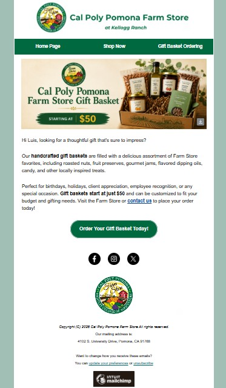
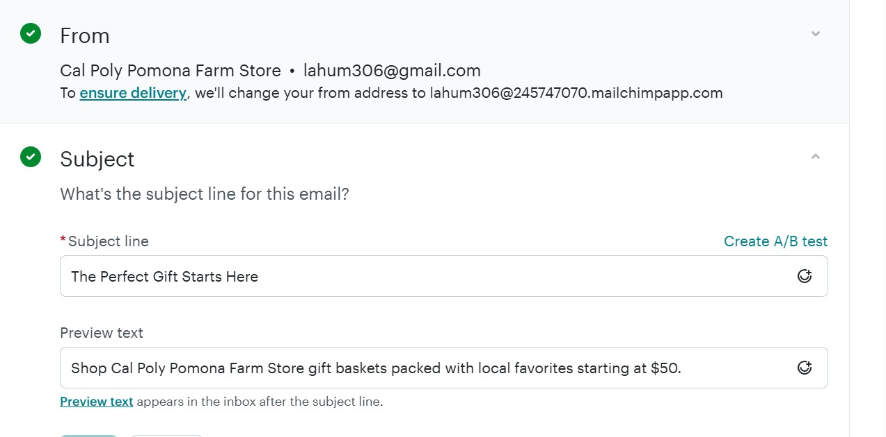

# Creative objective

The creative objective of the “Fresh from Our Farm to Your Campus” campaign is to increase awareness of the CPP Farm Store by creating engaging and visually appealing content that connects with the Cal Poly Pomona community. The campaign will highlight fresh seasonal produce, locally grown products, campus-made gift bundles, and convenient online ordering with in-store pickup, encouraging more people to explore everything the Farm Store has to offer.

Beyond promoting individual products, the campaign also aims to strengthen the Farm Store's brand by showcasing its unique role within the university community. Through consistent messaging and eye-catching visuals across digital platforms, the campaign seeks to inspire first-time visits, encourage repeat purchases, and build lasting relationships with customers by emphasizing freshness, convenience, and community involvement.

# Target audience

The primary target audience consists of Cal Poly Pomona students, faculty, staff, and nearby residents between the ages of 18 and 45 who value fresh food, convenient shopping, and supporting local agriculture. Many of these consumers have busy schedules and prefer quick, accessible shopping experiences. They regularly use digital platforms such as Instagram, TikTok, Google Search, and Google Shopping to discover new products, learn about promotions, and decide where to shop.

This audience is motivated by freshness, affordability, and sustainability. They are interested in seasonal produce, locally grown products, and unique campus-made gift bundles while also supporting businesses that contribute to the university community. The campaign will connect with this audience through engaging visuals and clear messaging that highlight the Farm Store's fresh products, convenient shopping options, and strong connection to Cal Poly Pomona. By aligning with their interests and shopping habits, the campaign aims to increase brand awareness, encourage customer engagement, and inspire both first-time and repeat visits to the CPP Farm Store.

## Key Message

The primary campaign message is:

> **Fresh from Our Farm to Your Campus.**

This message emphasizes the connection between CPP’s agricultural identity, the Farm Store, and the campus community. It communicates that customers can conveniently purchase fresh, locally grown, and seasonal products directly from Cal Poly Pomona.

Supporting messages may include:

- **Fresh, local, and grown close to campus.**
- **Discover what is fresh this week at CPP Farm Store.**
- **Shop local. Support CPP. Taste fresh.**

The message is designed to encourage students, faculty, staff, and nearby community members to view CPP Farm Store as a convenient destination for fresh products, seasonal items, and campus-related gifts. It also supports campaign tactics such as the “Fresh This Week” webpage, seasonal pickup bundles, and weekly social media posts.

## Tone and Style

The campaign will use a tone that is **fresh, friendly, welcoming, local, and student-friendly**. The language should be simple and conversational so customers can quickly understand what products are available, why they are valuable, and how to purchase or pick them up.

Visually, the campaign should use bright natural lighting, real product photography, seasonal produce, and recognizable elements of the CPP Farm Store or campus environment. Designs should feel clean and approachable, using warm earth tones, natural greens, and CPP brand colors when appropriate. Promotional materials should avoid appearing overly corporate or artificial and instead highlight authenticity, freshness, and the connection between the farm and the campus community.

Overall, the creative style should make CPP Farm Store feel convenient, trustworthy, and community-oriented while maintaining a consistent and professional connection to Cal Poly Pomona.

# Channel recommendations

To maximize awareness and increase customer engagement, the CPP Farm Store should use a combination of digital and campus-based marketing channels. Each channel reaches a different segment of the target audience while reinforcing the campaign message.

## Instagram

Instagram should be the primary marketing channel because it is widely used by Cal Poly Pomona students. The Farm Store can share photos and short videos of seasonal produce, locally made products, special promotions, and behind-the-scenes content. Instagram Stories and Reels can also be used to announce limited-time offers and events.

## Email Marketing

Email newsletters are an effective way to communicate with students, faculty, staff, alumni, and community members who subscribe to updates. Weekly emails can highlight seasonal products, promotions, campus events, and exclusive discounts while encouraging repeat visits.

## Facebook

Facebook is useful for reaching faculty, staff, alumni, parents, and local community members. The platform can be used to promote events, announce new products, and share educational content about locally grown produce and sustainable agriculture.

## CPP Website and Campus Communications

The Farm Store should utilize the Cal Poly Pomona website, campus newsletters, digital signage, and student announcements to increase visibility among the university community. These channels help reach people who are already on campus and may not follow the Farm Store on social media.

## Google Business Profile

Keeping the Farm Store's Google Business Profile updated with accurate hours, photos, promotions, and customer reviews improves visibility in Google Search and Google Maps. This makes it easier for new customers and visitors to discover the store.

## Why These Channels?

Using multiple marketing channels creates an integrated campaign that reaches customers wherever they are most active. Social media builds awareness and engagement, email encourages repeat purchases, campus communications increase visibility within the university, and Google helps attract new customers searching for local products. Together, these channels support the campaign objective of increasing awareness, driving store traffic, and promoting the unique products available at the CPP Farm Store.

| Channel | Purpose | Primary Audience |
|------------------|------------------|-----------------------------------|
| Instagram | Showcase products and promotions | Students |
| Email Marketing | Share weekly updates and offers | Students, faculty, staff, alumni |
| Facebook | Promote events and community engagement | Alumni and local community |
| CPP Website & Campus Communications | Increase on-campus awareness | University community |
| Google Business Profile | Improve local search visibility | Local shoppers and visitors |

# At least 3 sample creative assets

**Email**:

{width="404"}

**Subject Line + Preview Text:**

{width="453"}

# AI prompt documentation, if AI is used

Email Graphic Prompt Used:

Create a email graphic of a Cal Poly Pomona Farm Store Gift Basket . It is a box that inlcudes nuts, fruit preserves, flavored dipping oil, candy, jam etc. it starts at \$50. It's a banner that should fit on a regular mailchimp email. (This was the initial prompt, and I asked it to make changes to the graphic to get it to where wanted it to be.)

# Explanation of how the assets support the campaign plan

Email:

This email campaign supports the "Fresh from Our Farm to Your Campus" campaign that our group has planned by reaching exisitng customers who have subscribed to receive emails from the CPP Farm Store. This email focuses on reaching these existing customers with a direct, personalized promotion for the CPP Farm Store gift baskets. The subject line and preview text work together to catch the attention of the email recipients and highlight the value of the gift baskets by emphasizing locally made gift baskets starting at \$50.

Instagram Post and Product Image:

The IG post and the product image will extend the campaign's reach by increasing CPP Farm Store's digital presence. This will be done by showcasing seasonal products and promotions to both current followers and new audiences that do not know about the farm store. One main goal being the push of gift basket sales, by promoting them not only through email, but social media as well. By expanding the Farm Store's visibility across social media, these assets support the campaign objective of increasing awareness of not only the CPP Farm Store, but it's products too.

Together, the three assets create a cohesive cross channel marketing campaign that reinforces the CPP Farm Store's brand across different digital touch points. By maintaining consistent messaging and visual branding, the assets work together to increase awareness of the Farm Store, strengthen its digital presence, and encourage customers to explore products online.

# Appendix

- [GitHub Repo](https://github.com/lewiswaddell/GP5.git)

- [GitPage](https://lewiswaddell.github.io/GP5/)
